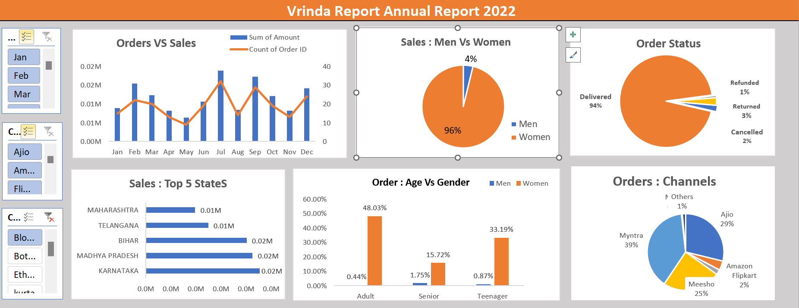

# 📊 Vrinda Store – Annual Sales Dashboard (Excel)

## 📊 Dashboard Preview

## 📌 Overview
This project is an **interactive Excel dashboard** built to analyze the **annual sales performance of Vrinda Store (2022)**.  
It provides actionable insights into **sales trends, customer demographics, order status, and channel performance** using Excel-based analytics.

🔹 Designed for **MIS Executive / Data Analyst (Entry-Level)** roles.

---

## 🧠 Problem Statement
Vrinda Store wanted a **single-view MIS dashboard** to:
- Track monthly sales & orders  
- Understand customer behavior  
- Monitor order fulfillment status  
- Identify top-performing states and sales channels  

---

## 🛠 Tools Used
- Microsoft Excel  
- Pivot Tables  
- Pivot Charts  
- Slicers  
- Data Cleaning  
- Dashboard Formatting  

---

## 📂 Dataset
The dataset contains **order-level transactional data** with the following columns:
- Order ID  
- Order Date  
- Month  
- Gender  
- Age Group  
- State  
- Channel  
- Order Status  
- Amount  

*(Sample e-commerce sales data used for analysis purposes)*

---

## 📈 Dashboard Features

### 🔹 Orders vs Sales (Monthly)
- Combo Chart (Bar + Line)  
- Sales Amount vs Order Count trend  

### 🔹 Sales by Gender
- Pie Chart  
- Men vs Women contribution  

### 🔹 Order Status Analysis
- Pie Chart  
- Delivered, Cancelled, Returned, Refunded  

### 🔹 Top 5 States by Sales
- Horizontal Bar Chart  
- Identifies high-revenue states  

### 🔹 Orders by Age Group & Gender
- Clustered Column Chart  
- Adult, Senior, Teenager comparison  

### 🔹 Orders by Sales Channel
- Pie Chart  
- Myntra, Ajio, Meesho, Amazon, Flipkart, Others  

---

## 🎛 Interactivity
- 📅 Month Slicer  
- 🛒 Channel Slicer  
- 👕 Category Slicer  

All visuals update dynamically based on filters.

---

## 📊 Key Insights
- Women contribute the **majority of sales**  
- Most orders are **successfully delivered**  
- **Myntra & Ajio** are top-performing channels  
- **Adult age group** drives the highest orders  
- A few states generate **maximum revenue**  

---

## 💼 Business Impact
- Enables **data-driven decision making**  
- Improves **sales & channel strategy**  
- Helps track **operational efficiency**  
- Acts as a reusable **MIS reporting template**  

---

## 📎 How to Use
1. Download the Excel file  
2. Open in Microsoft Excel  
3. Use slicers to filter data  
4. Explore insights interactively  

---

## 👤 Author
**Priyanshu Singh Bisht**  
Aspiring Data Analyst | MIS Executive  

---

## ⭐ Skills Demonstrated
- Excel Dashboards  
- MIS Reporting  
- Data Analysis  
- Business Insights  
- Data Visualization  
